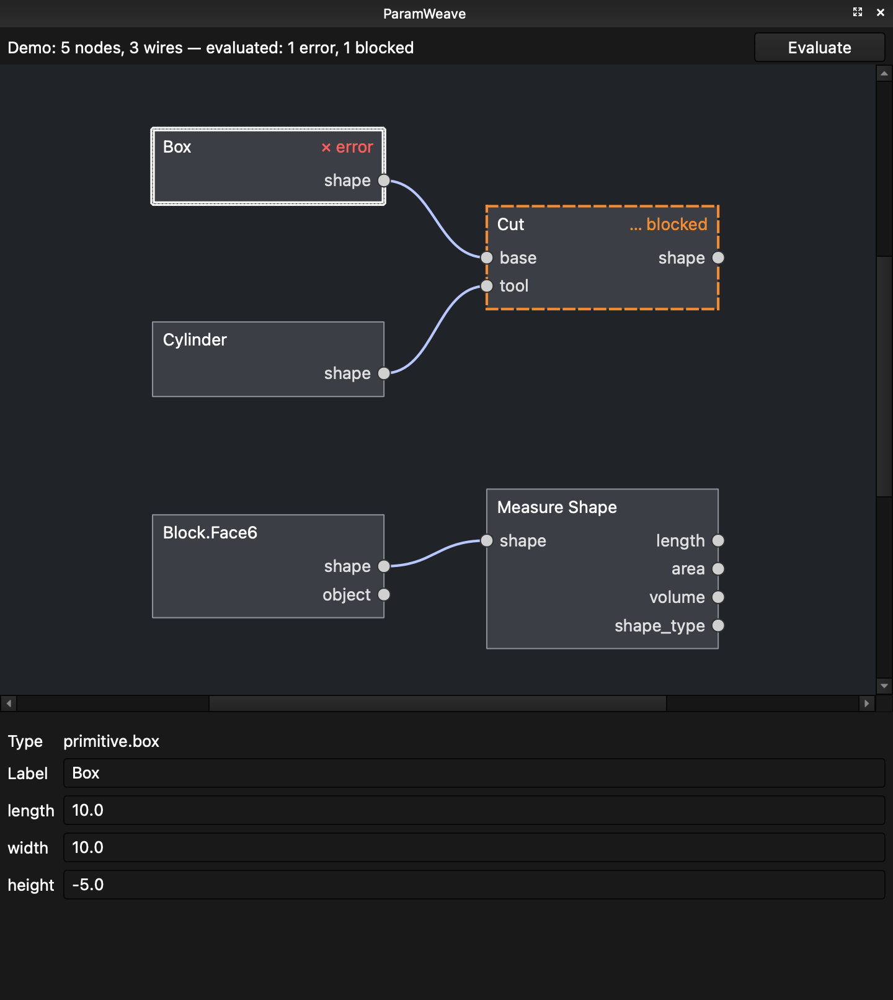

# ParamWeave — FreeCAD graph-workbench starter

> **Project name:** ParamWeave.

This folder is a coding-agent handoff package for a native FreeCAD workbench that places a patch/node graph beside the normal 3D view. Users can select FreeCAD objects, faces, edges, or vertices and create graph references to them; graph nodes can also construct and transform exact FreeCAD/OpenCascade geometry.

## Agreed project direction

- UI is **inside FreeCAD**, not a separate browser or Electron application.
- Target the **current stable FreeCAD 1.1.x line**, initially verified against **FreeCAD 1.1.3 on macOS**, while remaining platform-agnostic.
- The graph appears as a docked/split pane beside FreeCAD's existing 3D viewport.
- Initial scope includes both **reference nodes** and **constructive geometry nodes**.
- Graph state is **embedded in the `.FCStd` file**.
- FreeCAD remains authoritative for exact CAD geometry; the graph is authoritative for graph topology and graph-owned parameters.
- License is intentionally undecided. The desired eventual license is as permissive as practical while remaining compatible with FreeCAD and dependencies.
- Avoid hard dependencies on third-party node-editor libraries in the first prototype. The starter uses FreeCAD's bundled Qt/PySide graphics framework behind a replaceable UI layer.

## What is already scaffolded

The starter contains:

- a loadable external Python workbench layout (`Init.py`, `InitGui.py`);
- a Qt `QDockWidget` graph workspace intended to sit beside the normal FreeCAD 3D view;
- a serializable graph model with nodes, edges, schema versioning, validation, and topological ordering;
- embedded graph persistence in an `App::FeaturePython` document object;
- a node registry and typed ports;
- constructive nodes for Box, Cylinder, Translate, Fuse, and Cut;
- sketch nodes: elements (Line, Circle, Arc, Point, Rectangle, Regular Polygon), element
  modifiers (Combine, Move, Rotate, Remove, Set Construction, Add Constraint, Set
  Constraint Value), a **Sketch** node that writes an ordinary `Sketcher::SketchObject`,
  **Read Sketch** / **Drive Sketch Constraint** for existing document sketches, and Extrude;
- a FreeCAD reference node that can capture object/sub-element selection;
- measurement nodes for shape area/length/volume;
- generated `Part::Feature` output objects grouped under `ParamWeave Generated`;
- bidirectional selection synchronization hooks;
- a minimal native Qt graph scene/view with clickable input/output ports and wires;
- pure-Python unit tests for graph serialization and dependency ordering;
- design/architecture/roadmap documents intended for a coding agent.

The code is deliberately a **starter**, not a production-ready workbench. The first hardening pass on FreeCAD 1.1.3/macOS is done (see below); M3 dirty propagation and the M4 editing features are next.

## Current status



The starter has been run and hardened on **FreeCAD 1.1.3 / macOS arm64** (see
[`docs/COMPATIBILITY.md`](docs/COMPATIBILITY.md) for exact versions). Verified by
automated tests:

- workbench loads; one dock on the right; toggle works; no duplicate docks or
  observers after repeated workbench switches;
- the graph follows the active document (open, close, switch) and is only ever
  written to the document it belongs to; viewing a document never modifies it;
- graph edits (add, connect, move, rename, parameter edit, delete) are FreeCAD
  transactions, so **Edit → Undo/Redo** covers them;
- Box/Cylinder → Cut/Fuse/Translate evaluate to ordinary `Part::Feature`
  objects that are updated in place; intermediates are hidden;
- node status badges: `✕ error`, `… blocked` (upstream failed), `! check`
  (reference recovered geometrically), `? unknown` (unregistered type);
- whole-object/face/edge/vertex references, including objects nested in
  containers; graph ↔ viewport selection sync in both directions without
  collapsing multi-selection; deleted geometry marks references broken;
  ambiguous recovery is refused;
- malformed or unknown embedded graph data is surfaced and never overwritten.

## Developer install

```bash
python3 tools/install_dev.py      # symlinks ParamWeave/ into FreeCAD's user Mod directory
```

On FreeCAD 1.1 the user Mod directory is versioned — on macOS
`~/Library/Application Support/FreeCAD/v1-1/Mod`. If in doubt, run
`App.getUserAppDataDir()` in FreeCAD's Python console and pass
`--mod-dir <that>/Mod`. Use `--copy` where symlinks are unavailable. Restart
FreeCAD, then select **ParamWeave** from the workbench selector.

## Testing

```bash
python3 -m unittest discover -s tests -v   # pure graph core; no FreeCAD needed
python3 tools/run_freecad_tests.py         # FreeCAD console (freecadcmd) suite
python3 tools/run_freecad_tests.py --gui   # GUI smoke test; opens FreeCAD for ~15 s
```

The FreeCAD runners use a throwaway user profile, so your real FreeCAD
settings are never touched.

## Manual walkthrough

1. Create a new document and activate ParamWeave; the graph dock opens on the right.
2. Add **Box**, **Cylinder** and **Cut** nodes (toolbar, menu, or right-click the empty canvas).
3. Click `Box.shape` then `Cut.base`; click `Cylinder.shape` then `Cut.tool`
   (Esc or a click on empty canvas cancels a pending wire).
4. Press **Evaluate** in the dock. `Part::Feature` objects appear under
   **ParamWeave Generated**; only the Cut result is visible.
5. Select the Box node and change `length` in the property panel; Evaluate again —
   the same objects update. Try a negative value to see `✕ error` / `… blocked`.
6. Select a face of any shape in the 3D view and use **Reference From Selection**.
   Clicking the reference node highlights the face; clicking the face selects the node.
7. **Edit → Undo** steps back through graph edits. Save, close and reopen: the graph returns.

Sketch workflow: add **Rectangle** and **Circle** nodes, wire both into **Combine
Elements** (`a`, `b`), then into **Sketch**, then **Extrude**, and Evaluate. The
sketch appears as a normal Sketcher sketch you can open. To work from an existing
sketch, select it in the tree, create a reference node, and wire its `object`
into **Read Sketch** (copy and modify its elements) or **Drive Sketch Constraint**
(set one of its named dimensions in place). Element indices in modifier nodes
follow sketch order, e.g. `0, 2-4`; constraint refs are `index[:pos]` with
pos 1 start, 2 end, 3 center, and `-1`/`-2` for the H/V axes.

Driving dimensions: every numeric parameter on every node (rectangle `width`,
circle `radius`, constraint `value`, box `length`, …) also has an optional input
port of the same name. Wire a number into it and it overrides the stored value
(the property panel shows it as "driven by input"). Number sources, under
**Values** and **Sketch**:

- **Number**: a constant.
- **Expression**: a formula over inputs `a`–`d`, e.g. `a / 2 - b`,
  `max(a, 3) * cos(30)` (trig in degrees; `pi`, `sqrt`, `min`, `max`, `clamp`,
  `round`, `floor`, `ceil`, `atan2`, …, and `x if cond else y`).
- **Document Variable**: a numeric property of a document object by name or
  label, e.g. a Spreadsheet alias or a VarSet variable.
- **Sketch Dimension**: the value of a named constraint, read either from a graph
  sketch value (`geometry`) or from a referenced document sketch (`object`).
- **Measure Element**: length/radius/diameter/angle/x/y of one sketch element.

Tutorial: [docs/tutorial/finger-jointed-box.pdf](docs/tutorial/finger-jointed-box.pdf)
(source: `finger-jointed-box.md`) builds the same box by hand, step by step, with
pictures. Duplicate selected nodes with Ctrl+D (⌘D), and wire into an occupied
input to replace its wire.

Example: **ParamWeave → Example: Finger-Jointed Box** inserts a 32-node graph
for a six-panel finger-jointed box. Edit the constants on the left (length,
width, height, thickness, laser kerf, fingers along each axis) and Evaluate.
Kerf grows every panel outline by half the kerf so cut parts fit tight. Finger counts
are forced odd by expressions, and each panel is a **Finger Joint Panel →
Sketch → Extrude** chain, so every panel is also an ordinary sketch you can
export for cutting. The graph is built by `paramweave/examples/finger_box.py`.

Graph shortcuts: Delete/Backspace removes selected nodes or wires, `F` frames
all, mouse wheel zooms, middle-drag pans.

## Repository layout

```text
paramweave/
├── AGENTS.md                   # rules for coding agents (read first)
├── CLAUDE.md
├── README.md
├── LICENSE_STATUS.md
├── docs/                       # architecture, data model, decisions, compatibility
├── tests/                      # pure unit tests; freecad/ (console) and gui/ (smoke) suites
├── tools/                      # install_dev.py, run_freecad_tests.py, helpers
└── ParamWeave/                 # copy/symlink this directory into FreeCAD's Mod directory
    ├── Init.py
    ├── InitGui.py
    ├── package.xml.template
    └── paramweave/
        ├── app/              # graph model, persistence, references, evaluator
        ├── gui/              # dock, graph scene, Qt items, selection/document sync
        ├── nodes/            # node specs/evaluators
        └── resources/
```

## Important implementation constraints

Read `AGENTS.md` and `docs/ARCHITECTURE.md` before modifying the design. In particular:

- do not make Qt graphics objects the persistent graph model;
- do not make `.FCStd` XML editing the API;
- do not duplicate OpenCascade geometry in graph JSON;
- do not put solver/CNC hardware logic in the graph UI layer;
- do not assume `Face12` is a permanently stable identity;
- do not require a pip-installed GUI framework for the first usable version.

## Current FreeCAD target

At package creation time, FreeCAD **1.1.3** is the current stable release. The starter uses the `from PySide import QtCore, QtGui, QtWidgets` compatibility path exposed by FreeCAD rather than importing a separately installed PySide package.
