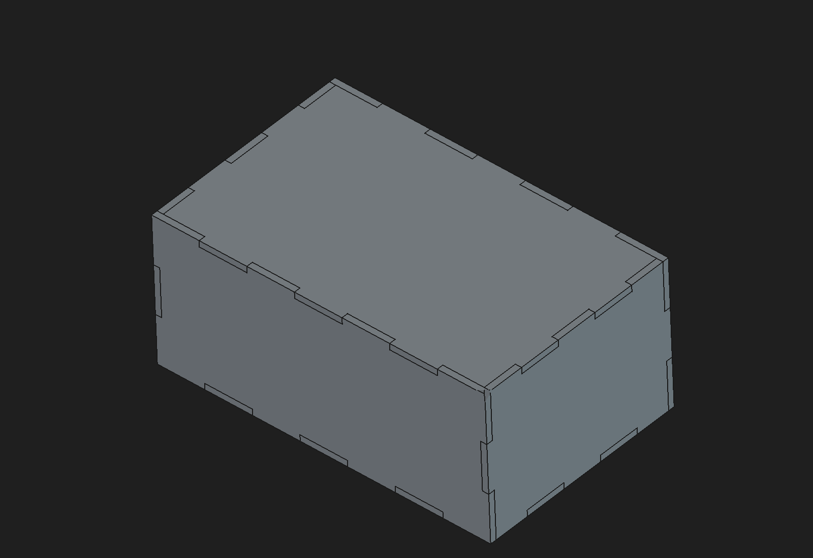

# ParamWeave

**A visual node graph for FreeCAD.** ParamWeave puts a patch-style dataflow graph
next to FreeCAD's 3D view. You pick faces, edges, sketches and values in your model,
drop them into the graph, and wire them through nodes that build, measure and drive
geometry. Everything the graph makes is an ordinary FreeCAD object, so your files
still open and work without the plugin.

> ⚠️ **Work in progress.** ParamWeave is early and under active development. Expect
> rough edges, missing features, and changes to how graphs are stored between
> versions. Please don't use it yet for work you can't afford to redo. Bug reports
> and feedback are very welcome.



## What you can do with it today

- **Reference your model.** Select an object, face, edge or vertex and turn it into a
  graph node. Selection syncs both ways: click a node to highlight its geometry, or
  click geometry to find its node. If a reference breaks, ParamWeave marks it as broken
  and won't guess which geometry you meant.
- **Build geometry.** Use primitives (Box, Cylinder), booleans (Fuse, Cut), transforms,
  and sketch elements (lines, circles, arcs, rectangles, polygons) that turn into real
  Sketcher sketches and extrusions.
- **Drive dimensions.** You can wire any numeric parameter to a constant, an
  expression, a spreadsheet or VarSet variable, a sketch constraint, or a measurement.
- **Make laser and CNC parts.** It has finger-joint panels with kerf compensation,
  dogbone and T-bone corner relief, a kerf calibration test sheet, and DXF/SVG
  cut-file export.
- **Work comfortably.** Undo/redo works through FreeCAD's normal Edit menu. You also
  get duplicate, frames and comments, and zoom/pan. The graph is saved inside your
  `.FCStd` file.

## Getting started

You'll need **FreeCAD 1.1** (developed and tested on 1.1.3, macOS Apple Silicon) and a
clone of this repository.

```bash
git clone https://github.com/andrewsharmon/paramweave.git
cd paramweave
python3 tools/install_dev.py
```

This links the `ParamWeave/` folder into FreeCAD's user `Mod` directory. Restart
FreeCAD and pick **ParamWeave** from the workbench selector, and the graph panel
opens on the right. If FreeCAD doesn't find it, see
[`docs/USER_GUIDE.md`](docs/USER_GUIDE.md) and the notes in
[`tools/install_dev.py`](tools/install_dev.py) about Mod directory locations and
`--copy` / `--mod-dir`.

Good first steps:

1. **ParamWeave → Example: Finger-Jointed Box** inserts a complete parametric box.
   Change the length, width or thickness constants and press **Evaluate**.
2. Work through the step-by-step tutorial,
   [Building a finger-jointed box](docs/tutorial/finger-jointed-box.pdf).
3. If you cut parts on a laser, the
   [kerf fit test](docs/tutorial/kerf-fit-test.md) helps you dial in your kerf value.

The [user guide](docs/USER_GUIDE.md) covers every node, shortcut and workflow.

## Status and roadmap

Working and covered by automated tests on FreeCAD 1.1.3 / macOS:

- workbench shell, graph saved in the document, undo/redo
- references and two-way selection sync
- constructive and sketch nodes
- node editing (property panel, node search, duplicate, frames)

Coming up:

- smarter re-evaluation (only recompute what changed)
- copy/paste
- better reference stability when the model changes
- drag-and-drop from the FreeCAD tree
- in-viewport handles

Windows, Linux and older FreeCAD versions haven't been tested yet. Reports from
those platforms are especially helpful. See
[`docs/ROADMAP.md`](docs/ROADMAP.md) and
[`docs/COMPATIBILITY.md`](docs/COMPATIBILITY.md).

## For developers

```bash
python3 -m unittest discover -s tests -v   # pure graph core, no FreeCAD needed
python3 tools/run_freecad_tests.py         # FreeCAD console suite
python3 tools/run_freecad_tests.py --gui   # GUI smoke test (opens FreeCAD briefly)
```

The FreeCAD test runners use a throwaway profile, so your settings are never touched.

The code has three layers: a pure-Python graph core (no FreeCAD or Qt imports), a
FreeCAD runtime that evaluates nodes and owns document objects, and a replaceable Qt
UI. Start with [`docs/ARCHITECTURE.md`](docs/ARCHITECTURE.md) and
[`docs/DECISIONS.md`](docs/DECISIONS.md). [`AGENTS.md`](AGENTS.md) lists the
architectural ground rules for anyone, human or AI, changing the code.

```text
ParamWeave/      the workbench itself (this is what gets installed into FreeCAD)
  paramweave/app/    graph model, persistence, references, evaluator
  paramweave/nodes/  node definitions
  paramweave/gui/    graph dock, scene, selection sync
docs/            architecture, design decisions, user guide, tutorials
tests/           pure unit tests, FreeCAD console tests, GUI scripts
tools/           install, test runners, tutorial builders
```

## License

Copyright 2026 Andrew Harmon. Licensed under the [Apache License 2.0](LICENSE).
See [`NOTICE`](NOTICE) and [`LICENSE_STATUS.md`](LICENSE_STATUS.md).
