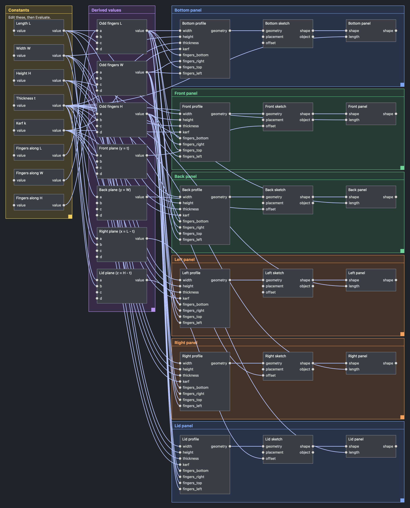
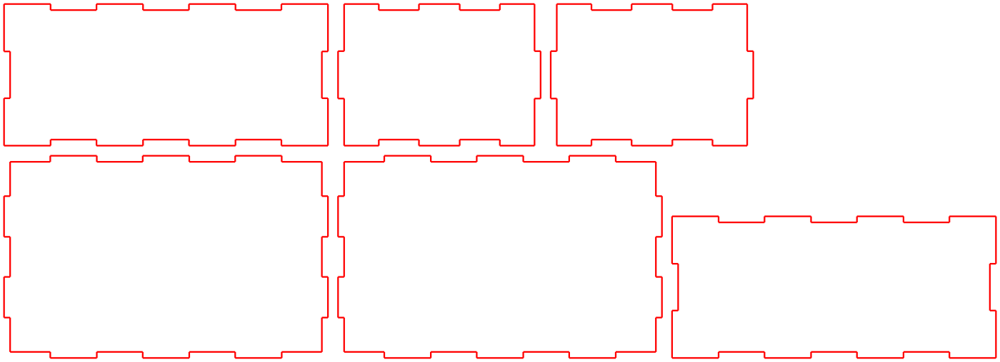

# ParamWeave user guide

A tour of what the workbench can do today. ParamWeave is under active development, so details here change often.

## Quick walkthrough

1. Create a new document and activate ParamWeave; the graph dock opens on the right.
2. Add **Box**, **Cylinder** and **Cut** nodes (toolbar, menu, or right-click the empty canvas).
3. Click `Box.shape` then `Cut.base`; click `Cylinder.shape` then `Cut.tool`
   (Esc or a click on empty canvas cancels a pending wire).
4. Press **Evaluate** in the dock. `Part::Feature` objects appear under
   **ParamWeave Generated**; only the Cut result is visible.
5. Select the Box node and change `length` in the property panel; Evaluate again —
   the same objects update. Try a negative value to see `✕ error` / `… blocked`.
6. Select a face of any shape in the 3D view and use **Reference From Selection**.
   Clicking the reference node highlights the face; clicking the face selects the node.
7. **Edit → Undo** steps back through graph edits. Save, close and reopen: the graph returns.

Sketch workflow: add **Rectangle** and **Circle** nodes, wire both into **Combine
Elements** (`a`, `b`), then into **Sketch**, then **Extrude**, and Evaluate. The
sketch appears as a normal Sketcher sketch you can open. To work from an existing
sketch, select it in the tree, create a reference node, and wire its `object`
into **Read Sketch** (copy and modify its elements) or **Drive Sketch Constraint**
(set one of its named dimensions in place). Element indices in modifier nodes
follow sketch order, e.g. `0, 2-4`; constraint refs are `index[:pos]` with
pos 1 start, 2 end, 3 center, and `-1`/`-2` for the H/V axes.

Driving dimensions: every numeric parameter on every node (rectangle `width`,
circle `radius`, constraint `value`, box `length`, …) also has an optional input
port of the same name. Wire a number into it and it overrides the stored value
(the property panel shows it as "driven by input"). Number sources, under
**Values** and **Sketch**:

- **Number**: a constant.
- **Expression**: a formula over inputs `a`–`d`, e.g. `a / 2 - b`,
  `max(a, 3) * cos(30)` (trig in degrees; `pi`, `sqrt`, `min`, `max`, `clamp`,
  `round`, `floor`, `ceil`, `atan2`, …, and `x if cond else y`).
- **Document Variable**: a numeric property of a document object by name or
  label, e.g. a Spreadsheet alias or a VarSet variable.
- **Sketch Dimension**: the value of a named constraint, read either from a graph
  sketch value (`geometry`) or from a referenced document sketch (`object`).
- **Measure Element**: length/radius/diameter/angle/x/y of one sketch element.

Tutorial: [tutorial/finger-jointed-box.pdf](tutorial/finger-jointed-box.pdf)
(source: `finger-jointed-box.md`) builds the same box by hand, step by step, with
pictures. Duplicate selected nodes with Ctrl+D (⌘D), and wire into an occupied
input to replace its wire.

Example: **ParamWeave → Example: Finger-Jointed Box** inserts a 32-node graph
for a six-panel finger-jointed box. Edit the constants on the left (length,
width, height, thickness, laser kerf, fingers along each axis) and Evaluate.
Kerf grows every panel outline by half the kerf so cut parts fit tight. Finger counts
are forced odd by expressions, and each panel is a **Finger Joint Panel →
Sketch → Extrude** chain, so every panel is also an ordinary sketch you can
export for cutting. The graph is built by `paramweave/examples/finger_box.py`.

Kerf fit test: **ParamWeave → Example: Kerf Fit Test** inserts a cuttable test
sheet for finding your kerf value. It has five finger-joint coupon pairs over a
range of kerf values, in three orientations (0°, 90°, 45°), because lasers often
cut X moves, Y moves and diagonals with different kerf. The pairs are rotated in
place and packed into three strips that stack into one rectangle (about 250 × 135
mm). Tutorial with rationale and how to read the results:
[tutorial/kerf-fit-test.md](tutorial/kerf-fit-test.md) (PDF alongside;
ready-to-cut `kerf-fit-test.svg`).

Corner relief for milling: Finger Joint Panel and Kerf Fit Test nodes have a
**corner_style** dropdown (`none`, `dogbone`, `tbone_depth`, `tbone_side`) and a
`tool_diameter`, which add circular relief at inside corners so a round end mill
lets square fingers seat fully.

Frames: select nodes and press Ctrl+G (⌘G), or right-click → **Frame Selected
Nodes**, to wrap them in a labeled, colored frame. Drag a frame by its title
bar to move everything inside it; drag the corner grip to resize. Select a
frame to edit its label, color and note; **Add Comment Here** makes a note-only
frame. Delete removes just the frame. Ctrl+D on a frame copies it with its
contents.

Cut files: **ParamWeave → Export Cut Files…** (toolbar, menu, or right-click the
canvas) lays every Sketch node flat on a sheet and saves a **DXF** (R12, mm, one
layer per panel) or **SVG** (mm, red hairline cut strokes, one group per panel).
Choose the sheet width and gap; tick *Only selected* to export just the selected
Sketch nodes or the Sketch nodes inside selected frames. The graph is evaluated
first, kerf comes from each panel's kerf input, and construction lines are
skipped.

Graph shortcuts: Delete/Backspace removes selected nodes or wires, `F` frames
all, mouse wheel zooms, middle-drag pans.
