# Tutorial: A Parametric Finger-Jointed Box

Build a six-panel finger-jointed box from scratch in the ParamWeave graph. Seven constants drive everything (outer size, material thickness and finger counts), so changing one number regenerates the whole box.

Each panel ends up as an ordinary FreeCAD sketch plus an extruded solid. The sketches are ready to export for laser cutting.

**What you will use:** Number, Expression, Finger Joint Panel, Sketch and Extrude nodes; wiring by clicking ports; the property panel; Duplicate; Evaluate.

**Time:** about 20 minutes. **Result:** 32 nodes, 73 wires.

> Every step in this tutorial was performed through the GUI and checked automatically: `python3 tools/run_freecad_tests.py --gui-script tests/gui/tutorial_finger_box.py` rebuilds the box this way and regenerates these pictures.

## Before you start: working in the graph

- **Add a node:** right-click an empty spot on the graph canvas, open a category and pick the node. It appears where you clicked.
- **Select a node:** click its title bar. The property panel below the graph shows its settings. Ctrl-click (⌘-click on macOS) adds more nodes to the selection, or drag a box around them.
- **Edit a setting:** click the field in the property panel, type, and press Return.
- **Rename a node:** edit its **Label** field. Labels are only names; renaming never breaks wires.
- **Wire two nodes:** click an *output* port dot (right side of a node), then an *input* port dot (left side). Esc cancels a half-made wire. Wiring into an input that already has a wire replaces the old wire.
- **Wired settings:** every number setting has an input port with the same name. Once wired, the field shows *driven by input* and the wire's value is used.
- **Delete:** select a node or click a wire, then press Delete.
- **Duplicate:** select nodes and press Ctrl+D (⌘D on macOS), or right-click the empty canvas and choose **Duplicate Selected**. Copies keep the wires coming into them.
- **Move and view:** drag a node by its title bar; scroll to zoom; press F to frame everything.
- **Evaluate:** click **Evaluate** at the top of the graph pane to build or update the geometry.

## How the box fits together

The box is 160 × 100 × 70 mm made of 3 mm material, with panels at their full outer size. Along every joint one panel has *fingers* and the other has matching *slots*. Each panel edge has a **mode**:

- `out`: starts and ends with a finger at the panel's outer edge.
- `in`: starts and ends with a slot, cut in by the material thickness.

Two edges that meet always use opposite modes and the same finger count. Finger counts must be odd so every edge reads the same from either end.

| Panel | Size | Bottom / top edges | Left / right edges | Plane | Offset |
|---|---|---|---|---|---|
| Bottom | L × W | in, L fingers | in, W fingers | XY | 0 |
| Lid | L × W | in, L fingers | in, W fingers | XY | H − t |
| Front | L × H | out, L fingers | out, H fingers | XZ | −t |
| Back | L × H | out, L fingers | out, H fingers | XZ | −W |
| Left | W × H | out, W fingers | in, H fingers | YZ | 0 |
| Right | W × H | out, W fingers | in, H fingers | YZ | L − t |

The XZ plane faces −Y, so a negative offset moves the front and back sketches toward +Y. Each panel is extruded by t along its sketch's normal, so it lands inside the box.

## Step 1: Open the ParamWeave workbench and the graph pane

1. Install the workbench once with `python3 tools/install_dev.py` and restart FreeCAD.
2. Pick **ParamWeave** in the workbench selector.
3. Create a new document (**File → New**).
4. If the graph pane isn't showing, click **Toggle Graph**.

The pane on the right is the graph canvas; its lower half is the property panel. The status line reads *0 nodes, 0 wires*.

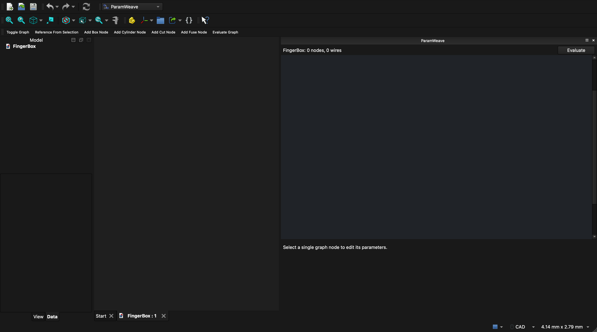

## Step 2: Add the constants

Add seven **Values → Number** nodes, one for each constant. For each one, set **Label** and **value** in the property panel:

| Label | value |
|---|---|
| Length L | 160 |
| Width W | 100 |
| Height H | 70 |
| Thickness t | 3 |
| Fingers along L | 7 |
| Fingers along W | 5 |
| Fingers along H | 3 |

Stack them in a column at the left of the canvas. These are the only numbers you will ever need to change.

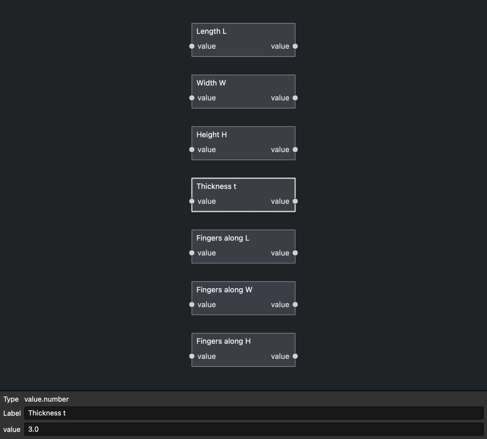

## Step 3: Add the expressions

Add seven **Values → Expression** nodes in a second column. An Expression computes its **expression** text from its inputs `a`, `b`, `c` and `d`. Set the Label and expression, then wire the listed constants' `value` outputs into the listed inputs:

| Label | expression | Wires in |
|---|---|---|
| Odd fingers L | `max(1, 2 * floor(a / 2) + 1)` | Fingers along L → a |
| Odd fingers W | `max(1, 2 * floor(a / 2) + 1)` | Fingers along W → a |
| Odd fingers H | `max(1, 2 * floor(a / 2) + 1)` | Fingers along H → a |
| Front plane (y = t) | `-a` | Thickness t → a |
| Back plane (y = W) | `-a` | Width W → a |
| Right plane (x = L - t) | `a - b` | Length L → a, Thickness t → b |
| Lid plane (z = H - t) | `a - b` | Height H → a, Thickness t → b |

The three "Odd fingers" expressions round any count up to the next odd number, so typing 8 fingers gives 9 instead of an error. The other four compute where each panel's sketch plane sits.

> Expressions support + − × ÷, `**`, `min`, `max`, `floor`, `ceil`, `round`, `sqrt`, `abs`, `clamp`, degree-based trig (`sin`, `cos`, `atan2`, …), `pi`, and `x if condition else y`.

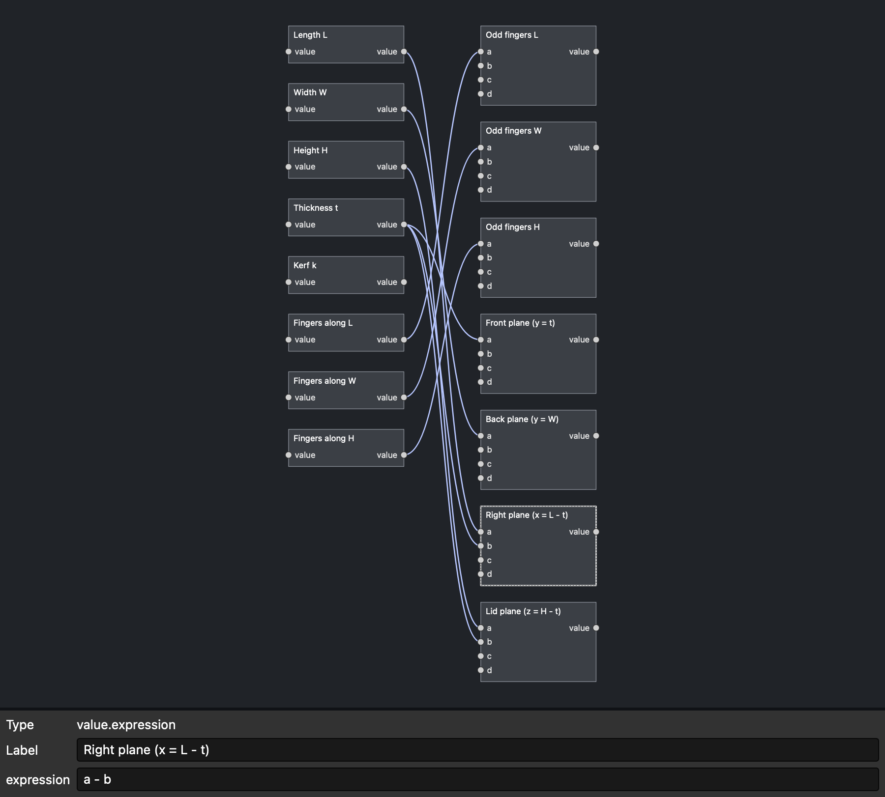

## Step 4: Add the bottom panel profile

1. Add **Sketch Elements → Finger Joint Panel** in a third column and label it `Bottom profile`.
2. Set all four modes, **mode_bottom**, **mode_right**, **mode_top** and **mode_left**, to `in`.
3. Wire the panel's size and finger counts:
   - Length L → **width**, Width W → **height**, Thickness t → **thickness**
   - Odd fingers L → **fingers_bottom** and **fingers_top**
   - Odd fingers W → **fingers_right** and **fingers_left**

The wired fields now read *driven by input*. The edge modes are plain text fields further down the property panel.

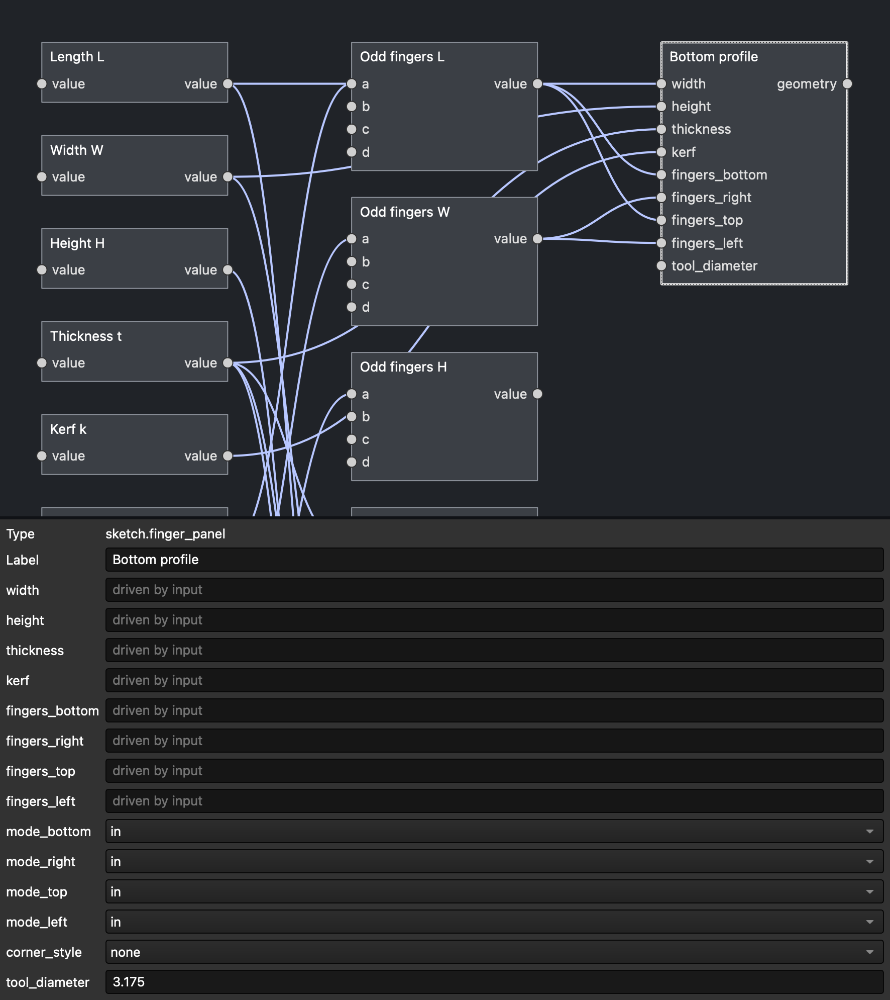

## Step 5: Turn the profile into a sketch and extrude it

1. Add **Sketch → Sketch**, label it `Bottom sketch`, and wire *Bottom profile* **geometry** → **geometry**. Leave **plane** at `XY` and **offset** at 0.
2. Add **Construct → Extrude**, label it `Bottom panel`, and wire *Bottom sketch* **shape** → **shape**. Then wire Thickness t → **length**.
3. Click **Evaluate**.

Every node turns green (*ok*). FreeCAD now has a real **Bottom sketch** (a Sketcher object you can open) and a **Bottom panel** solid in the *ParamWeave Generated* group. The sketch is hidden because the extrude uses it.

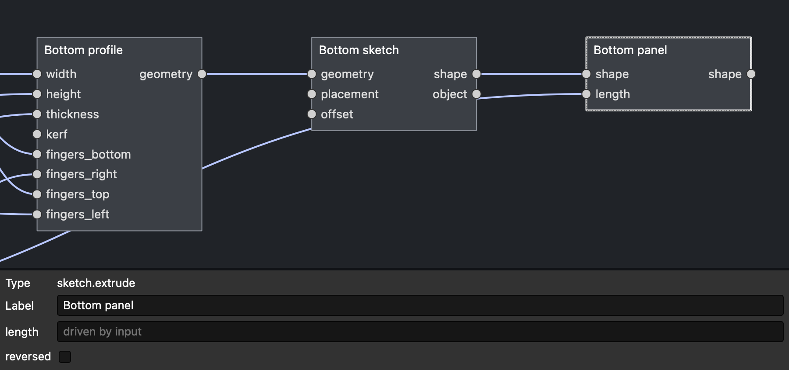

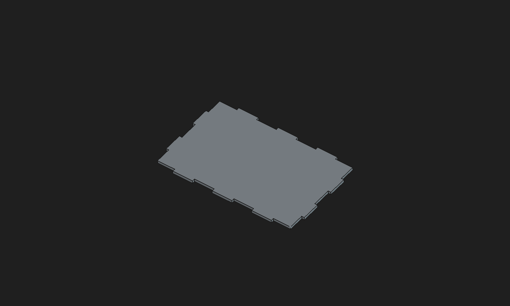

## Step 6: Duplicate the bottom chain to make the lid

The lid is identical to the bottom, just raised to the top.

1. Click **Bottom profile**, then Ctrl-click (⌘-click) **Bottom sketch** and **Bottom panel**.
2. Press **Ctrl+D** (⌘D). Three copies appear, already wired to the same constants, and they are selected.
3. Drag the copies below the other panels and rename them `Lid profile`, `Lid sketch` and `Lid panel`.
4. Wire the **Lid plane (z = H - t)** expression's **value** → *Lid sketch* **offset**.
5. Click **Evaluate**.

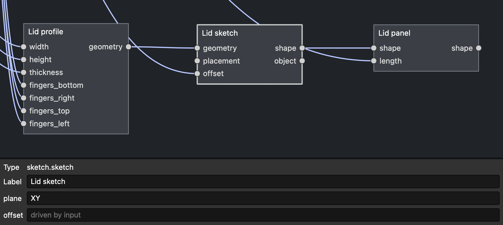

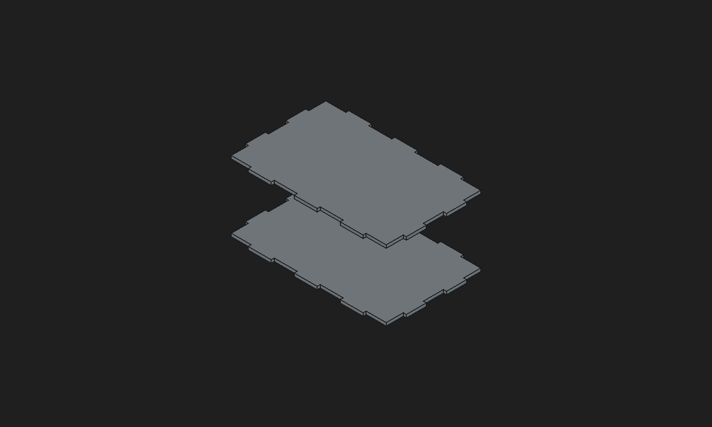

## Step 7: Duplicate again for the front wall and change it

1. Select the three **bottom** nodes again, duplicate them, drag the copies into a new row and rename them `Front profile`, `Front sketch` and `Front panel`.
2. On *Front profile*, set all four modes to `out`.
3. Re-wire the front profile's height and side finger counts. Wiring into an occupied input replaces the old wire:
   - Height H → **height** (replaces Width W)
   - Odd fingers H → **fingers_right** and **fingers_left**
4. On *Front sketch*, set **plane** to `XZ` and wire **Front plane (y = t)** → **offset**.
5. Click **Evaluate**.

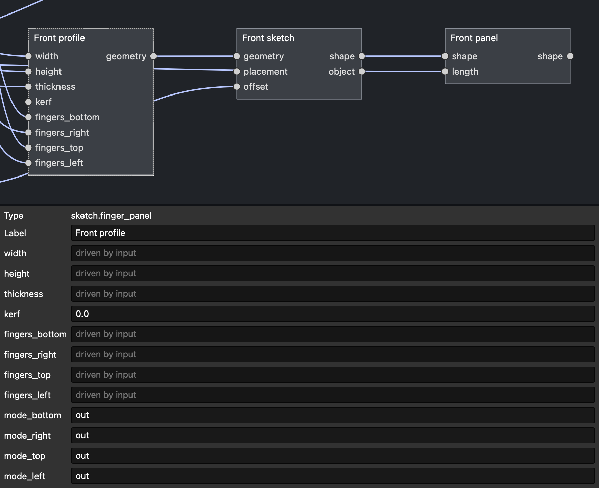

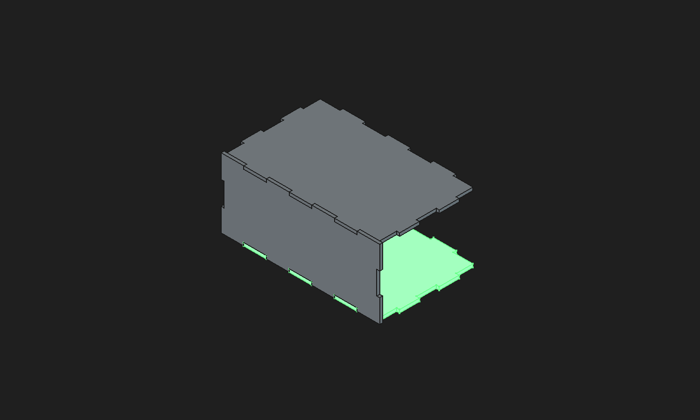

## Step 8: Duplicate the front wall to make the back wall

1. Select the three **front** nodes, duplicate them, move the copies into a new row and rename them `Back profile`, `Back sketch` and `Back panel`.
2. Wire **Back plane (y = W)** → *Back sketch* **offset** (replaces the front plane wire).
3. Click **Evaluate**.

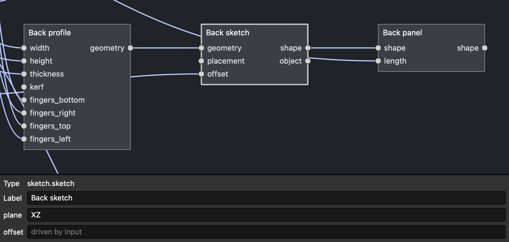

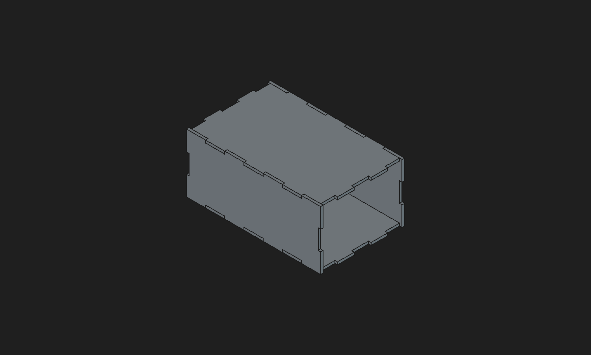

## Step 9: Duplicate the front wall for the left wall and change it

1. Duplicate the three **front** nodes once more. Move the copies into a new row and rename them `Left profile`, `Left sketch` and `Left panel`.
2. On *Left profile*:
   - wire Width W → **width**;
   - wire Odd fingers W → **fingers_bottom** and **fingers_top**;
   - set **mode_right** and **mode_left** to `in`, so the vertical edges take the front and back walls' fingers.
3. On *Left sketch*, set **plane** to `YZ`.
4. The left wall sits at x = 0, so it needs no offset wire. Click the wire going into *Left sketch* **offset**, press **Delete**, then set **offset** to `0`.
5. Click **Evaluate**.

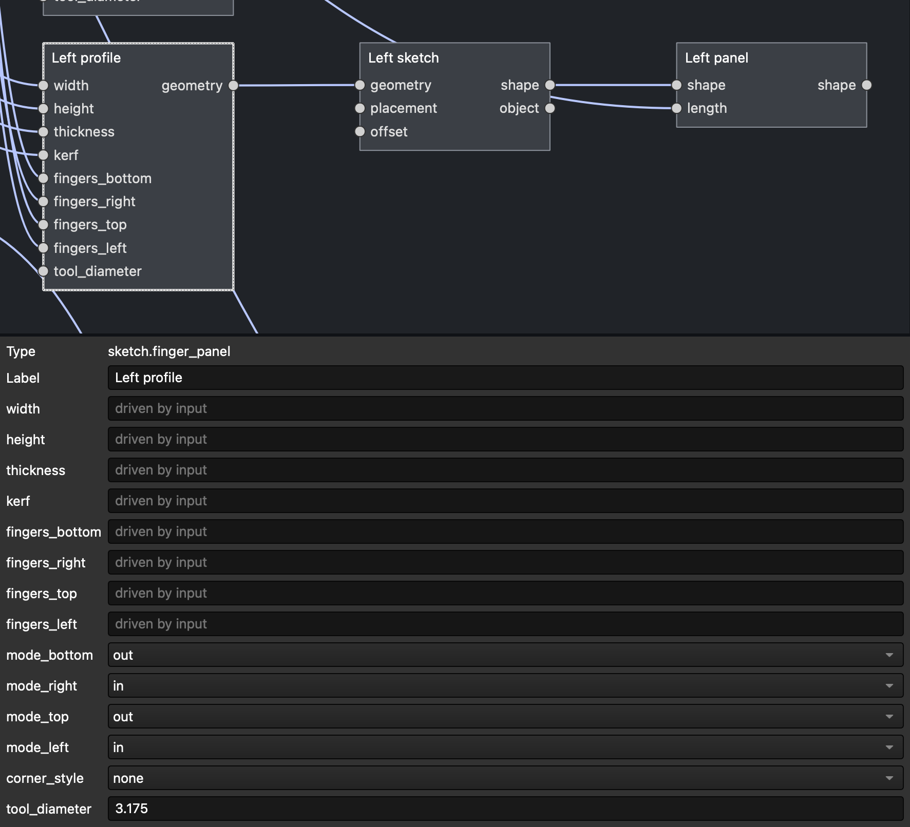

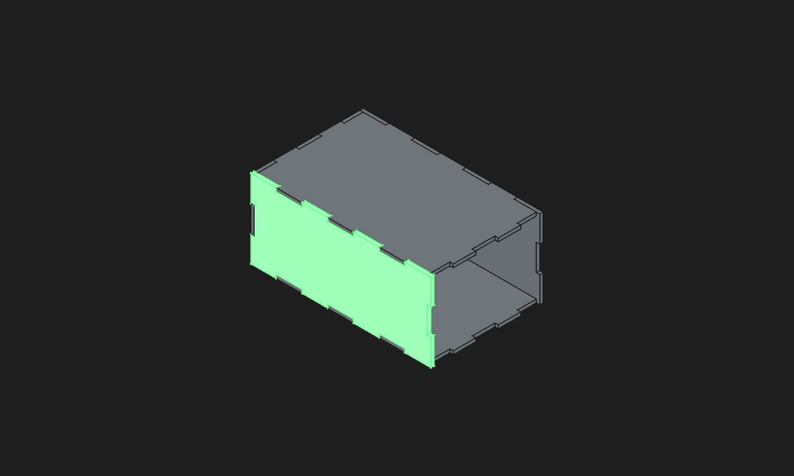

## Step 10: Duplicate the left wall to make the right wall

1. Duplicate the three **left** nodes, move them into the last row and rename them `Right profile`, `Right sketch` and `Right panel`.
2. Wire **Right plane (x = L - t)** → *Right sketch* **offset**.
3. Click **Evaluate**, then press **F** to frame the whole graph.

The status line reads *32 nodes, 73 wires — evaluated: all ok*. The model tree lists six hidden sketches and six visible panels.

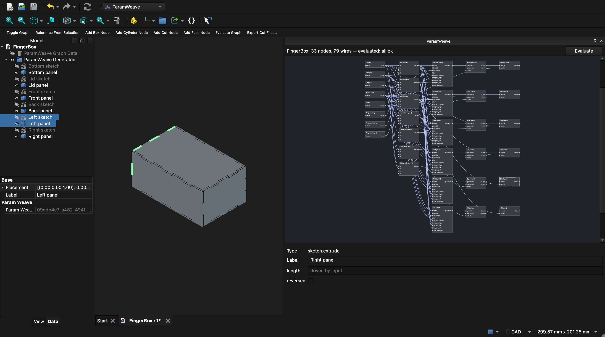

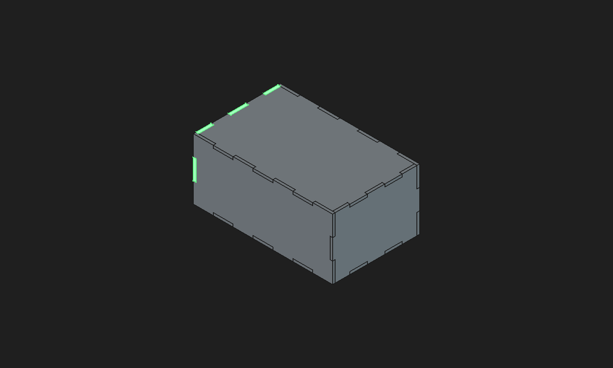

## Step 11: Change a constant and re-evaluate

This is where the graph pays off. Select **Thickness t** and set it to `6`, then select **Fingers along L** and set it to `4`. Click **Evaluate**.

All six panels regenerate in place, without duplicating any objects:

- every slot is now 6 mm deep;
- the length edges show *5* fingers (4 rounded up to the next odd number);
- the lid and right-wall planes move inward to follow the new thickness.

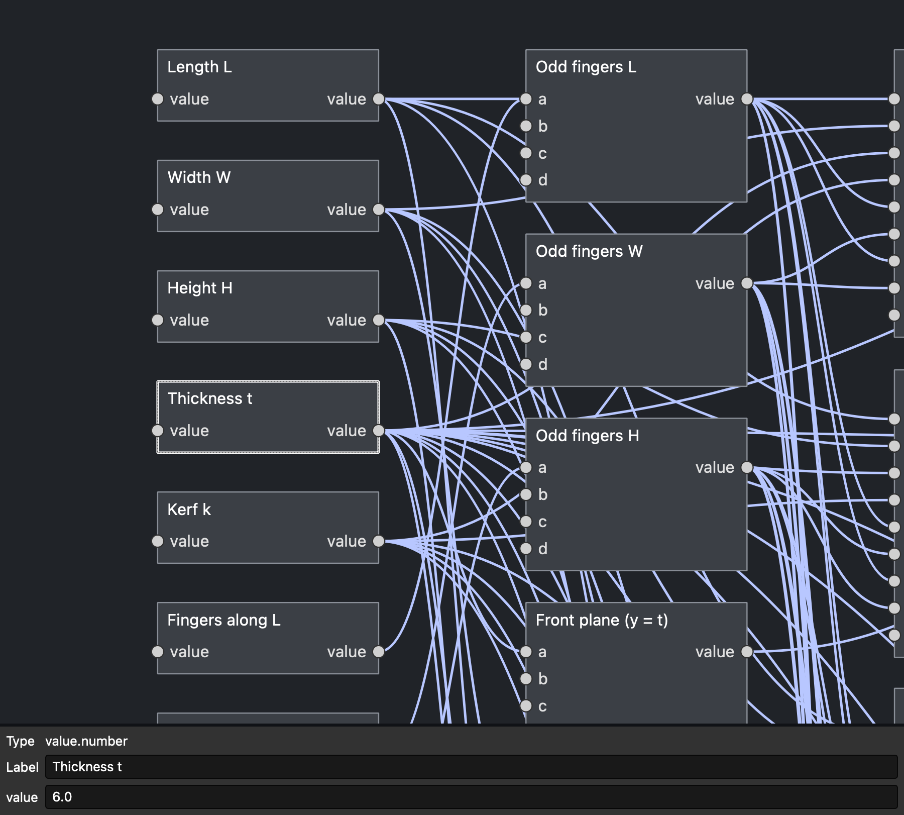

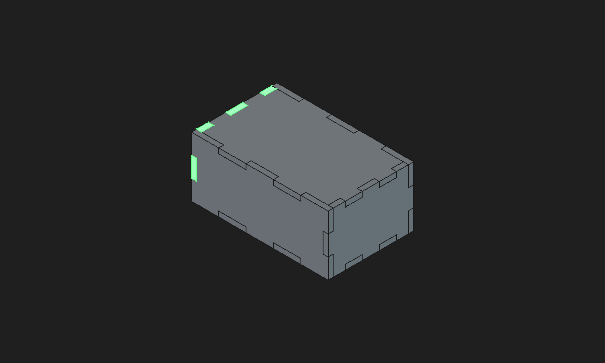

## Where to go next

- **Export for cutting:** each hidden *… sketch* object is a normal Sketcher sketch. Select it and use FreeCAD's DXF/SVG export.
- **Open-top box:** delete the three lid nodes and set **mode_top** to `flat` on the four wall profiles.
- **Drive from a spreadsheet:** replace a Number node with **Values → Document Variable** that points at a Spreadsheet alias.
- **Shortcut:** **ParamWeave → Example: Finger-Jointed Box** inserts this same graph in one step.

Known limitation: there is no kerf or clearance allowance yet, so the joints are drawn at exact size.
