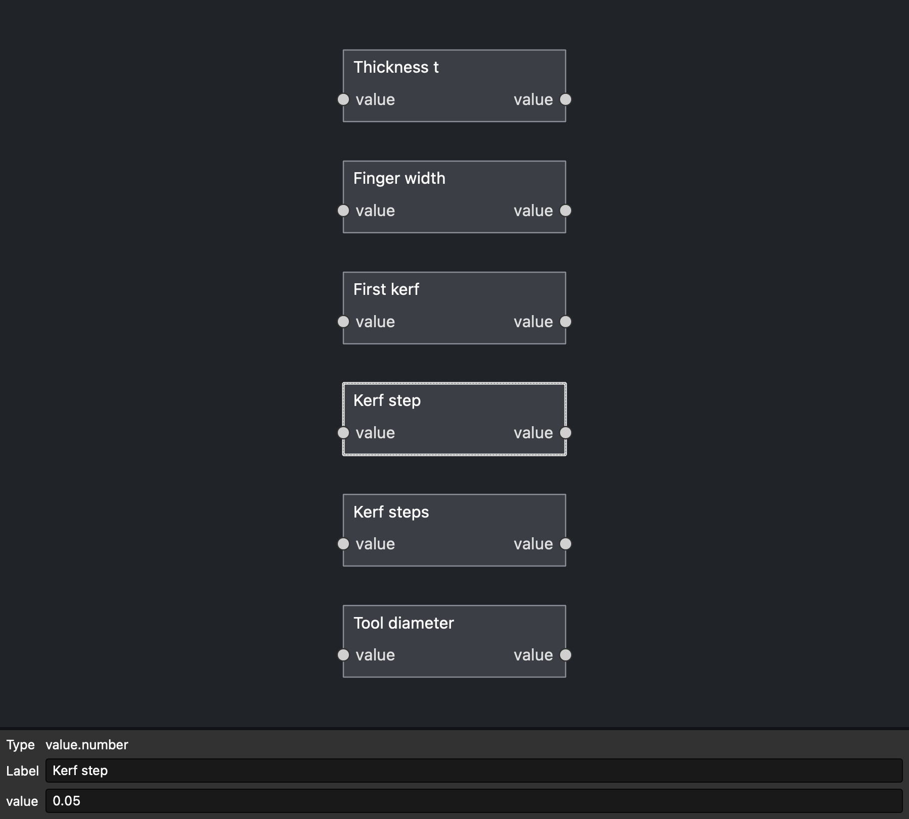
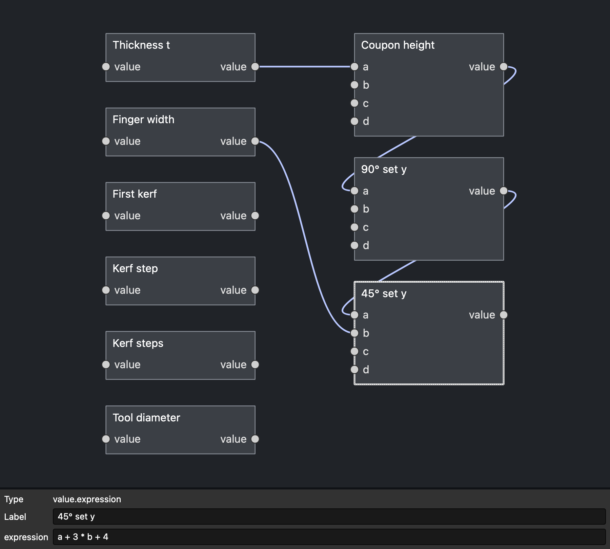
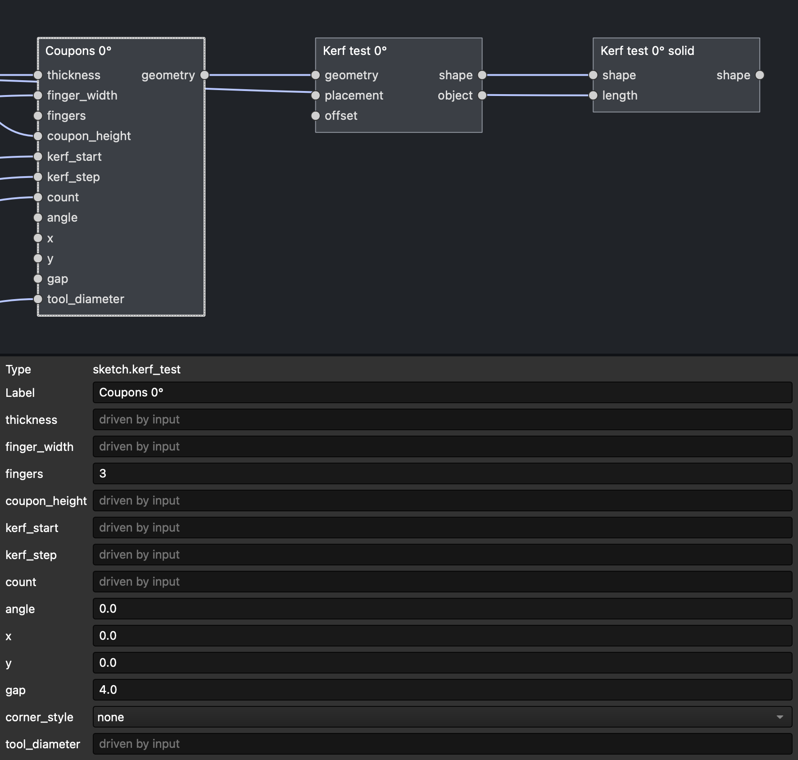
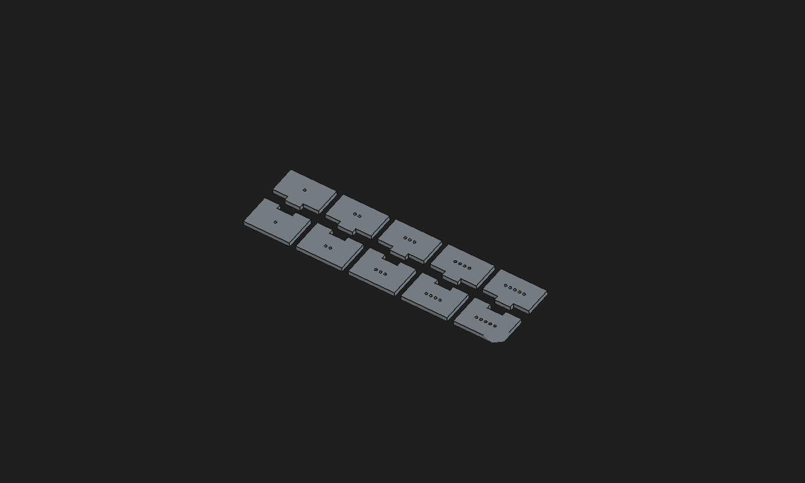
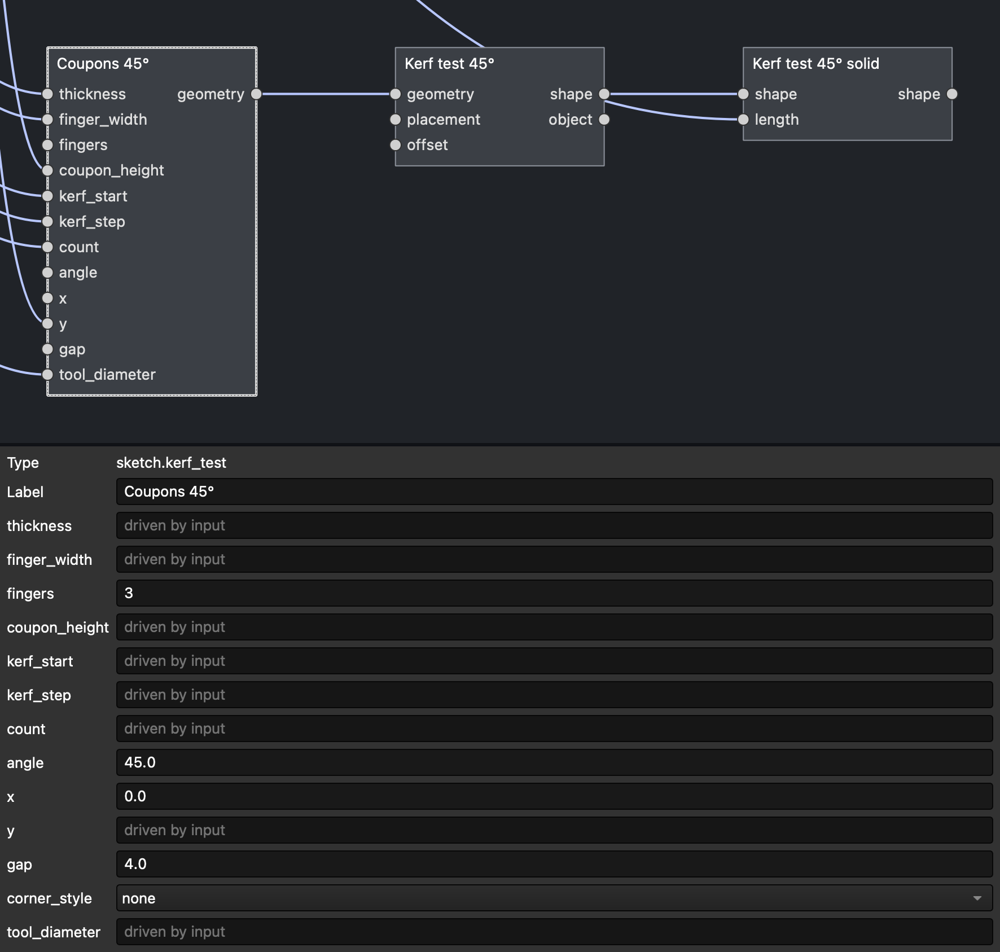
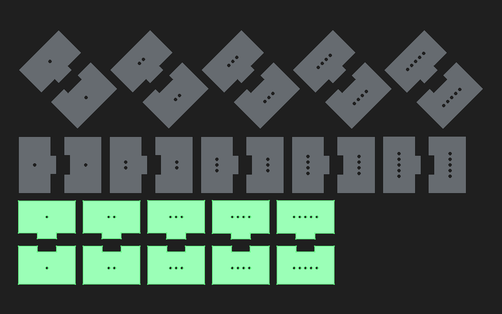
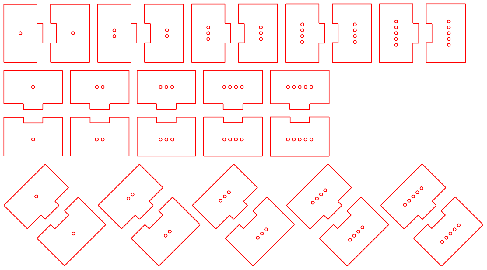
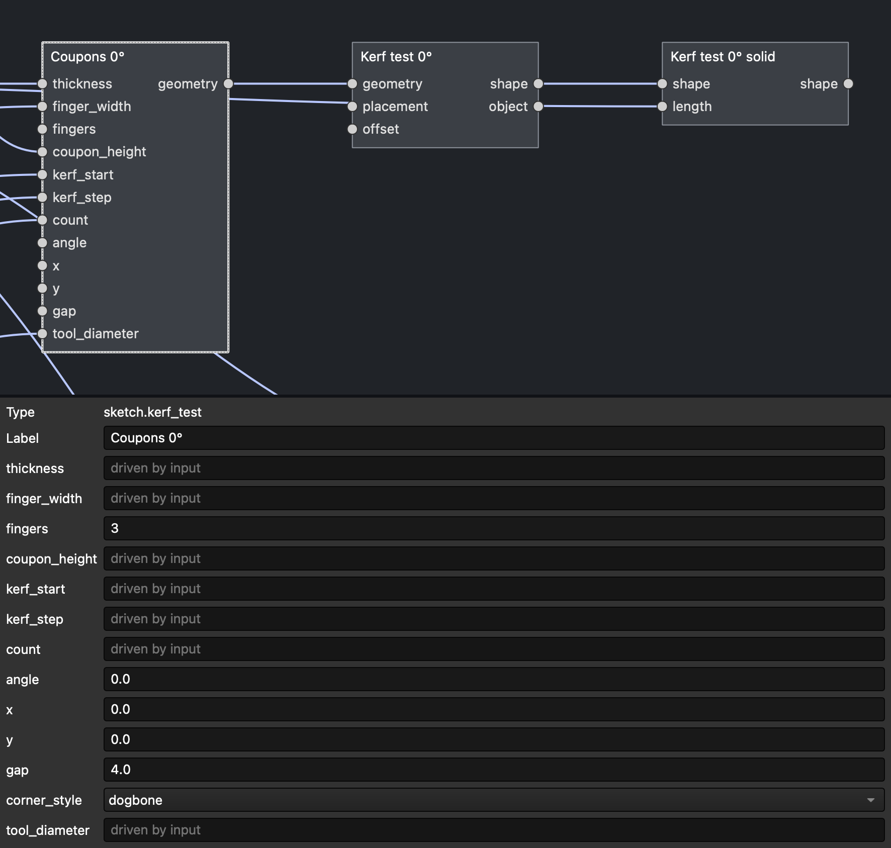
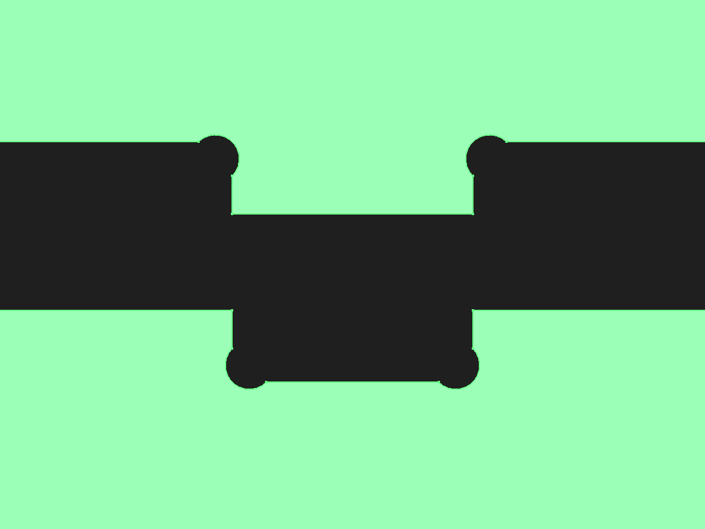
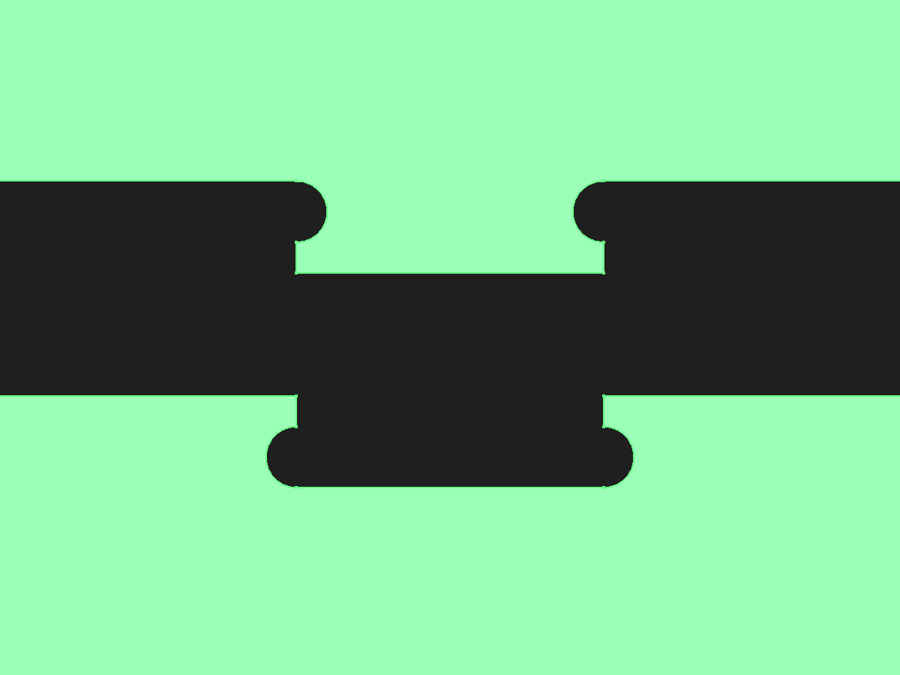

# Tutorial: A Kerf Fit Test at 0°, 90° and 45°

A laser or cutter removes a strip of material, the **kerf**. If a finger joint is drawn at its nominal size, the fingers come out a little narrower and the slots a little wider, and the joint is loose. ParamWeave's **Finger Joint Panel** fixes this with its `kerf` setting, which grows the outline by half the kerf. You still need the right number for your machine and material, though, and it is easier to find by test-cutting than by measuring.

This tutorial builds a small cuttable test. It has five pairs of finger-joint coupons, each pair drawn with a different kerf value, laid out in three orientations. Cut it, push each tab into its slot, and use the kerf value of the pair that fits the way you want.

**What you will use:** Number, Expression, Kerf Fit Test, Sketch and Extrude nodes; the property panel, including the **corner_style** dropdown; Duplicate; Evaluate; Export Cut Files.

**Time:** about 10 minutes, plus one short cut. **Result:** 18 nodes, one cut sheet of about 250 × 135 mm.

**Shortcut:** **ParamWeave → Example: Kerf Fit Test** inserts the same graph in one step, with frames around each part. **Finished file:** `kerf-fit-test.FCStd` next to this tutorial, plus the ready-to-cut sheet `kerf-fit-test.svg` for 3 mm material and kerf 0.00–0.20 mm.

> Every step here was performed through the GUI and checked automatically: `python3 tools/run_freecad_tests.py --gui-script tests/gui/tutorial_kerf_test.py` rebuilds the test this way and regenerates these pictures, the `.FCStd` and the `.svg`.

The basic graph actions (adding nodes from the right-click menu, wiring ports, editing settings, Duplicate, Evaluate) work as described in the finger-jointed box tutorial's *Before you start* section.

## Why three angles?

A finger's width, which sets how tight the joint is, comes from the two cuts along the finger's *walls*. Those walls run perpendicular to the joint edge. So each orientation measures a different direction of cut:

| Set | Joint edge runs along | Walls are cut by moving along | What it measures |
|---|---|---|---|
| 0° | X | Y | kerf of Y-axis moves |
| 90° | Y | X | kerf of X-axis moves |
| 45° | the diagonal | X and Y together | kerf when both axes move at once |

On a perfect machine all three sets would fit best at the same value. On real machines they often don't:

- **The beam spot is not perfectly round.** Mirror misalignment, a tilted or dirty lens, or astigmatism make the focused spot slightly elliptical, so the cut is wider in one direction than the other.
- **CO₂ lasers are polarised.** A linearly polarised beam cuts differently parallel and perpendicular to the polarisation, which gives direction-dependent kerf, especially in metals and thick stock.
- **The two axes behave differently.** The gantry's X and Y axes differ in moving mass, belt length and stretch, backlash, acceleration limits and steps-per-mm calibration. Scale or backlash errors show up as a different effective kerf per axis.
- **Diagonals combine both.** At 45° both motors move at once. Axis-to-axis mismatch, small squareness errors and the cutter's speed at corners all show up there, and nowhere else.
- **The material has a direction.** Plywood grain and extruded acrylic can char or melt differently along and across the sheet.

If the three sets agree, use that value. If they differ, choose the value from the direction your joints will mostly be cut in, or a value between them for a joint that must work both ways. A large difference is also worth fixing at the machine: check mirror alignment and the lens first.

## How the test pieces work

Each **pair** is a *tab coupon* and a *slot coupon*. Both are made of 3 fingers of width `f`, and both are ordinary Finger Joint Panels:

- The tab coupon's top edge is `out`: fingers at both ends, a gap in the middle.
- The slot coupon's bottom edge is `in`: slots at both ends, a finger in the middle.

Pair *i* is drawn with kerf `First kerf + i × Kerf step`. Its fingers are that much wider than nominal and its slots that much narrower. Pair *i* also has *i* small **index holes** on both coupons, so you can tell pairs apart after cutting: one hole is the first kerf value, five holes the last.

**Packing on the sheet.** Each pair is rotated in place and the pairs are laid in a row as tightly as they fit, so every orientation is a compact horizontal strip. At 45° neighbouring pairs nest into each other's corners. The three strips stack into one rectangle (about 250 × 135 mm with the defaults, about half of it coupons), with a 4 mm gap everywhere.

## Step 1: Start a new document

Switch to the ParamWeave workbench, create a new document and open the graph pane (**ParamWeave → Toggle Graph**).

## Step 2: Add the constants

Add six **Values → Number** nodes and set their labels and values:

| Label | Value | Meaning |
|---|---|---|
| Thickness t | 3 | material thickness (mm) |
| Finger width | 10 | width of each finger and slot (mm) |
| First kerf | 0 | kerf used for pair 1 (mm) |
| Kerf step | 0.05 | kerf added per pair (mm) |
| Kerf steps | 5 | number of pairs per orientation (1–12, limited by coupon width) |
| Tool diameter | 3.175 | only used by milling corner styles (mm) |

A range of 0–0.20 mm suits most CO₂ lasers in 3 mm plywood or acrylic. Diode lasers usually need less, and thick stock more. Once you know roughly where the fit is, cut again with a smaller step around it.

## Step 3: Add the expressions

Add three **Values → Expression** nodes. They size the coupons for the thickness and stack the three strips:

| Label | Expression | Inputs |
|---|---|---|
| Coupon height | `max(20, 4 * a + 4)` | a ← Thickness t |
| 90° set y | `2 * a + 8` | a ← Coupon height |
| 45° set y | `a + 3 * b + 4` | a ← 90° set y, b ← Finger width |

The 0° strip is two coupons plus a 4 mm gap tall (`2h + 4`), so the 90° strip starts 4 mm above it. A pair turned 90° is one coupon wide (`3f`) tall, so the 45° strip starts `3f + 4` above that.

## Step 4: Add the 0° set

1. Add **Sketch Elements → Kerf Fit Test** and label it `Coupons 0°`. Wire Thickness t → `thickness`, Finger width → `finger_width`, Coupon height → `coupon_height`, First kerf → `kerf_start`, Kerf step → `kerf_step`, Kerf steps → `count` and Tool diameter → `tool_diameter`. Leave `angle` at 0 and `corner_style` at **none** (laser).
2. Add **Sketch → Sketch** (`Kerf test 0°`) and wire the coupons' `geometry` into it.
3. Add **Construct → Extrude** (`Kerf test 0° solid`). Wire the sketch's `shape` into it and Thickness t into `length`.
4. Click **Evaluate**.

## Step 5: Duplicate for 90° and 45°

Select the three nodes of the 0° chain and press Ctrl+D (⌘D). Label the copies `Coupons 90°`, `Kerf test 90°` and `Kerf test 90° solid`, and set the copy's `angle` to 90. Wire **90° set y** into its `y` input. Do the same again for 45°, wiring **45° set y** into `y`. Evaluate.

## Step 6: Save and export the cut sheet

Save the document, then **ParamWeave → Export Cut Files…**. Set **Sheet width** to about 250 mm (just wider than the widest strip) and **Gap** to 4 mm. The exporter then stacks the three strips into one rectangle. Choose SVG or DXF.

## Using the test

1. **Cut** the sheet with the power, speed and focus you use for real parts, in the material you will use. Before lifting parts out, mark each strip's orientation on the back in pencil (0, 90, 45), because the three strips' coupons look alike once loose.
2. **Fit each pair.** Push the tab coupon's fingers into the slot coupon's slots at a right angle, the way a box corner goes together. Compare pairs within each orientation:
   - **Falls apart / rattles:** kerf too small.
   - **Slides together by hand and holds its own weight:** a good *slip fit*, the usual choice for glued joints.
   - **Needs a firm push or a light tap, then holds tight:** a *press fit*, good for glueless joints.
   - **Won't go in, or cracks the coupon:** kerf too large.
3. **Read the value.** The number of index holes tells you which pair it is. Kerf = `First kerf + (holes − 1) × Kerf step`. With the defaults: 1 hole 0.00, 2 holes 0.05, 3 holes 0.10, 4 holes 0.15, 5 holes 0.20 mm.
4. **Compare orientations.** See *Why three angles?* above.
5. **Use it.** Enter the value in **Kerf k** of the finger-jointed box (or in the `kerf` of any Finger Joint Panel) and Evaluate. Keep a note per machine, material and lens.

If no pair fits, shift **First kerf** past the end of the range and cut again. If two neighbouring pairs both seem right, halve **Kerf step** around them.

## Step 7 (milling): corner relief

A router or CNC mill cuts with a round tool. It can't cut a sharp *inside* corner: it leaves a fillet the size of the tool radius, and a square finger won't seat in a slot with rounded bottom corners. Every Kerf Fit Test and Finger Joint Panel node has a **corner_style** dropdown in the property panel that adds relief at inside corners for a tool of **tool_diameter**:

| corner_style | Shape | Use when |
|---|---|---|
| `none` | sharp corners | laser, waterjet, knife: the default |
| `dogbone` | a circle on the corner's bisector, biting equally into both edges | the general-purpose choice; smallest relief |
| `tbone_depth` | a circle centred on the slot bottom: the relief goes deeper into the part, finger and slot walls stay straight | tight joints: the walls that carry the fit keep full contact, and the relief is hidden behind the mating part |
| `tbone_side` | a circle centred on the wall: the relief widens the slot near its bottom | the relief must not go deeper, e.g. slots near a panel edge |

Each relief circle passes exactly through the sharp corner, so the tool reaches it. The 3D view shows it: set **Tool diameter** to the tool you will use (here 2 mm), pick a style from the dropdown, and Evaluate.

The index holes are also made at least 0.5 mm wider than the tool, so a mill can cut them. If the tool is too large for a finger, slot or wall, the node reports an error naming the edge length instead of producing an uncuttable outline. Use a smaller tool or wider fingers.

With a mill, the CAM software normally compensates for the tool radius, so keep `kerf` for the *fit* allowance you want (often 0 or a few hundredths of a millimetre) and run the same test to find it. The three orientations still matter: mill deflection and axis backlash are also direction-dependent.

Picking from the dropdown is an ordinary graph edit, so Undo/Redo work, and the choice is saved in the `.FCStd`.
